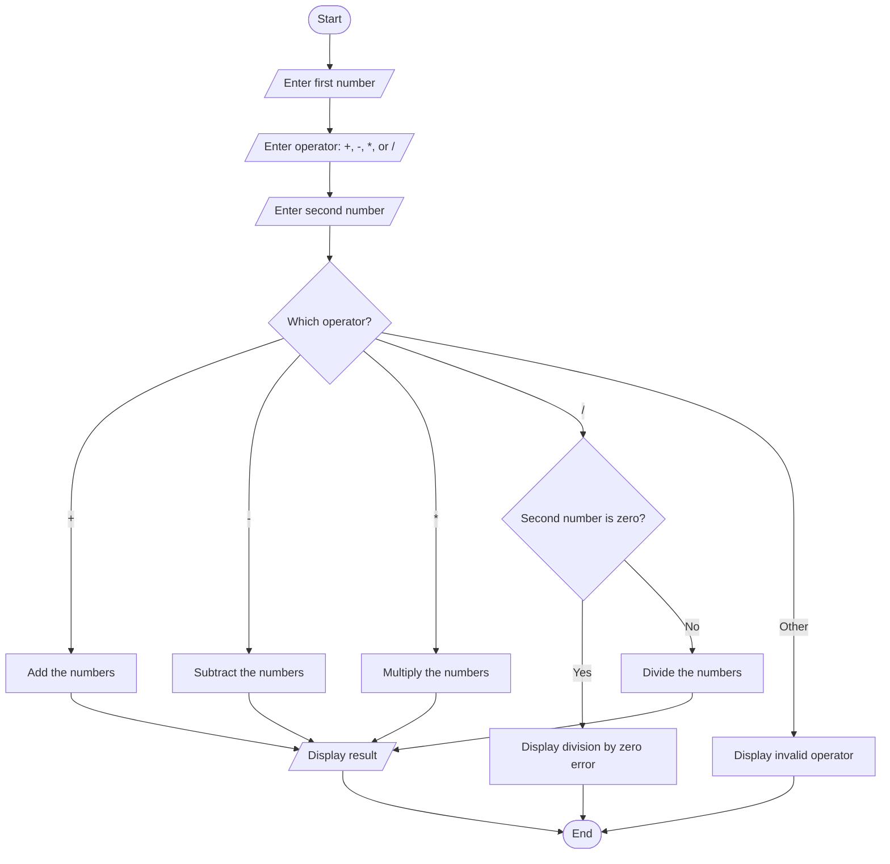

# Simple Calculator — Flowchart

```mermaid
flowchart TD
    A([Start]) --> B[/Enter first number/]
    B --> C[/Enter operator: +, -, *, or //]
    C --> D[/Enter second number/]
    D --> E{Which operator?}
    E -->|+| F[Add the numbers]
    E -->|-| G[Subtract the numbers]
    E -->|*| H[Multiply the numbers]
    E -->|/| I{Second number is zero?}
    I -->|Yes| J[Display division by zero error]
    I -->|No| K[Divide the numbers]
    E -->|Other| L[Display invalid operator]
    F --> M[/Display result/]
    G --> M
    H --> M
    K --> M
    J --> N([End])
    L --> N
    M --> N
```