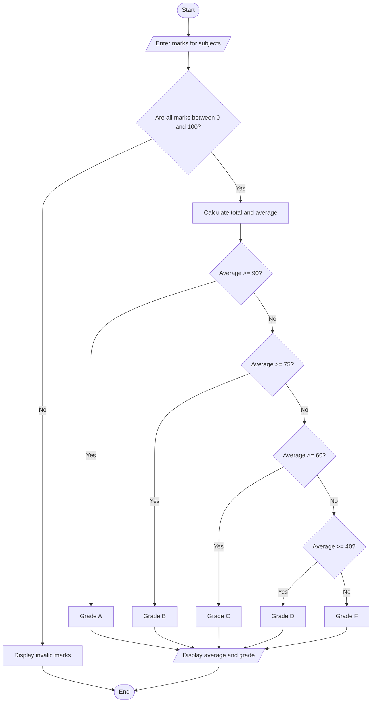

# Student Grade Calculator — Flowchart

```mermaid
flowchart TD
    A([Start]) --> B[/Enter marks for subjects/]
    B --> C{Are all marks between 0 and 100?}
    C -->|No| D[Display invalid marks]
    D --> K([End])
    C -->|Yes| E[Calculate total and average]
    E --> F{Average >= 90?}
    F -->|Yes| G[Grade A]
    F -->|No| H{Average >= 75?}
    H -->|Yes| I[Grade B]
    H -->|No| J{Average >= 60?}
    J -->|Yes| L[Grade C]
    J -->|No| M{Average >= 40?}
    M -->|Yes| N[Grade D]
    M -->|No| O[Grade F]
    G --> P[/Display average and grade/]
    I --> P
    L --> P
    N --> P
    O --> P
    P --> K
```