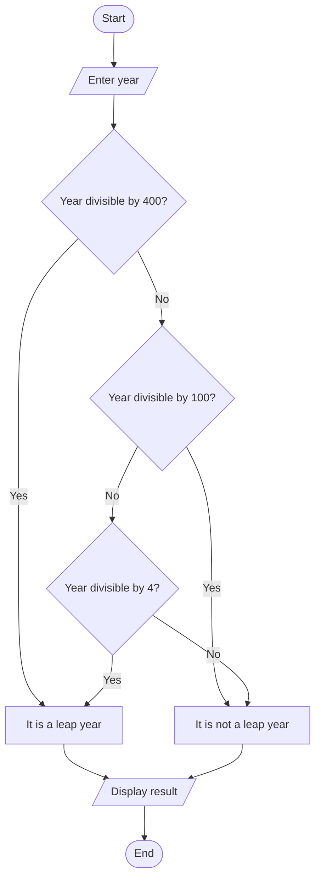

# Leap Year Checker — Flowchart

```mermaid
flowchart TD
    A([Start]) --> B[/Enter year/]
    B --> C{Year divisible by 400?}
    C -->|Yes| D[It is a leap year]
    C -->|No| E{Year divisible by 100?}
    E -->|Yes| F[It is not a leap year]
    E -->|No| G{Year divisible by 4?}
    G -->|Yes| D
    G -->|No| F
    D --> H[/Display result/]
    F --> H
    H --> I([End])
```