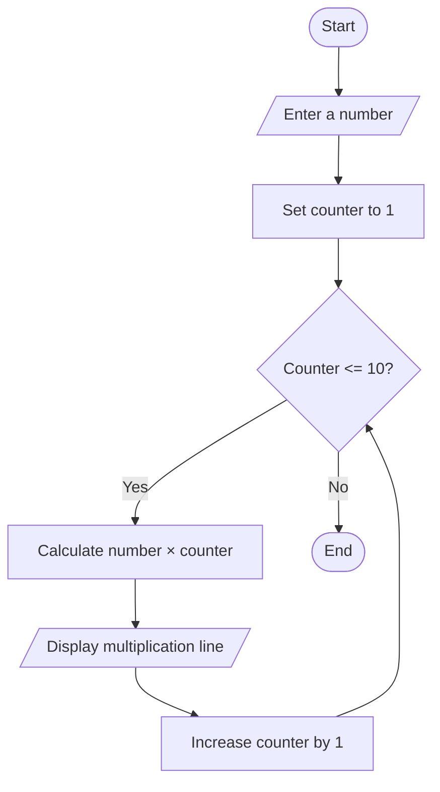

# Multiplication Table — Flowchart

```mermaid
flowchart TD
    A([Start]) --> B[/Enter a number/]
    B --> C[Set counter to 1]
    C --> D{Counter <= 10?}
    D -->|Yes| E[Calculate number × counter]
    E --> F[/Display multiplication line/]
    F --> G[Increase counter by 1]
    G --> D
    D -->|No| H([End])
```