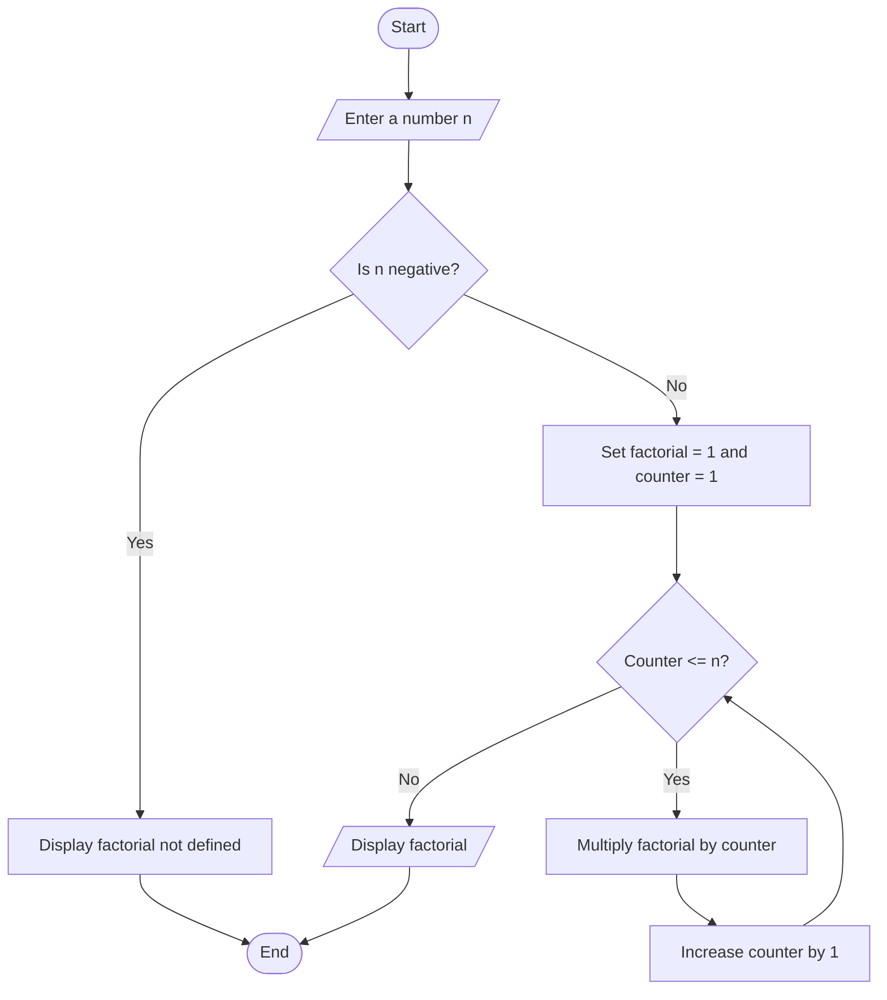

# Factorial — Flowchart

```mermaid
flowchart TD
    A([Start]) --> B[/Enter a number n/]
    B --> C{Is n negative?}
    C -->|Yes| D[Display factorial not defined]
    D --> I([End])
    C -->|No| E[Set factorial = 1 and counter = 1]
    E --> F{Counter <= n?}
    F -->|Yes| G[Multiply factorial by counter]
    G --> H[Increase counter by 1]
    H --> F
    F -->|No| J[/Display factorial/]
    J --> I
```