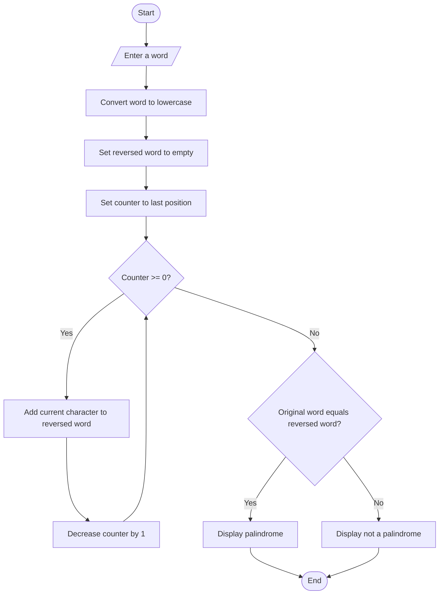

# Palindrome Checker — Flowchart

```mermaid
flowchart TD
    A([Start]) --> B[/Enter a word/]
    B --> C[Convert word to lowercase]
    C --> D[Set reversed word to empty]
    D --> E[Set counter to last position]
    E --> F{Counter >= 0?}
    F -->|Yes| G[Add current character to reversed word]
    G --> H[Decrease counter by 1]
    H --> F
    F -->|No| I{Original word equals reversed word?}
    I -->|Yes| J[Display palindrome]
    I -->|No| K[Display not a palindrome]
    J --> L([End])
    K --> L
```