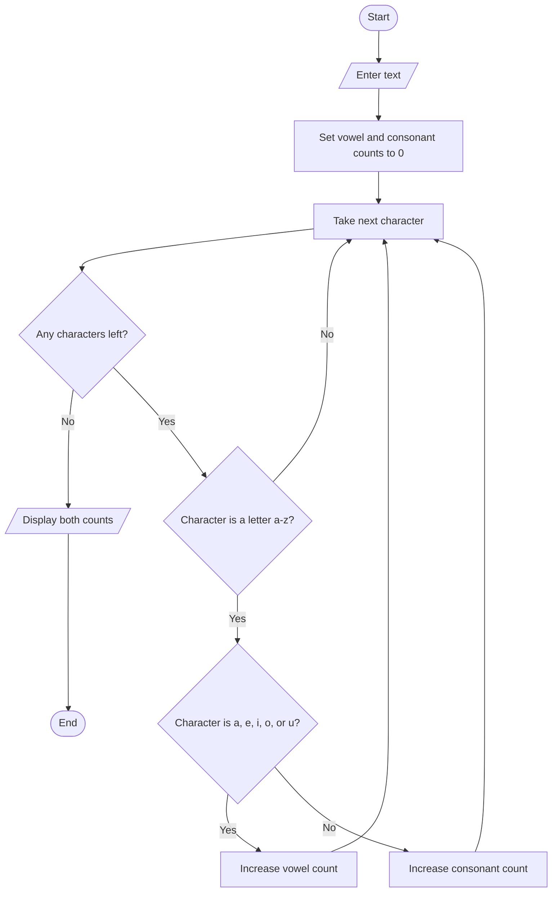

# Vowel and Consonant Counter — Flowchart

```mermaid
flowchart TD
    A([Start]) --> B[/Enter text/]
    B --> C[Set vowel and consonant counts to 0]
    C --> D[Take next character]
    D --> E{Any characters left?}
    E -->|No| J[/Display both counts/]
    E -->|Yes| F{Character is a letter a-z?}
    F -->|No| D
    F -->|Yes| G{Character is a, e, i, o, or u?}
    G -->|Yes| H[Increase vowel count]
    G -->|No| I[Increase consonant count]
    H --> D
    I --> D
    J --> K([End])
```