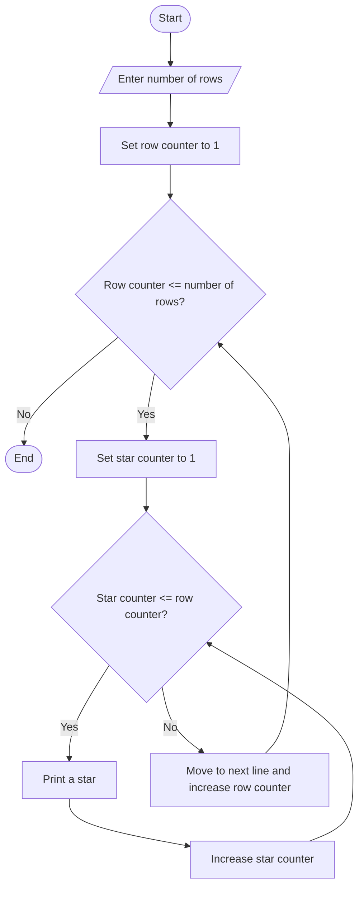

# Star Pattern — Flowchart

```mermaid
flowchart TD
    A([Start]) --> B[/Enter number of rows/]
    B --> C[Set row counter to 1]
    C --> D{Row counter <= number of rows?}
    D -->|No| J([End])
    D -->|Yes| E[Set star counter to 1]
    E --> F{Star counter <= row counter?}
    F -->|Yes| G[Print a star]
    G --> H[Increase star counter]
    H --> F
    F -->|No| I[Move to next line and increase row counter]
    I --> D
```