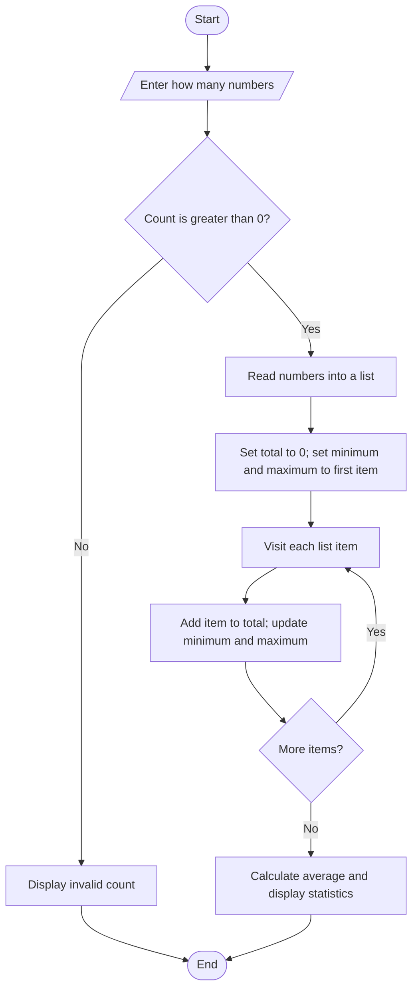

# List Statistics — Flowchart

```mermaid
flowchart TD
    A([Start]) --> B[/Enter how many numbers/]
    B --> C{Count is greater than 0?}
    C -->|No| D[Display invalid count]
    D --> K([End])
    C -->|Yes| E[Read numbers into a list]
    E --> F[Set total to 0; set minimum and maximum to first item]
    F --> G[Visit each list item]
    G --> H[Add item to total; update minimum and maximum]
    H --> I{More items?}
    I -->|Yes| G
    I -->|No| J[Calculate average and display statistics]
    J --> K
```