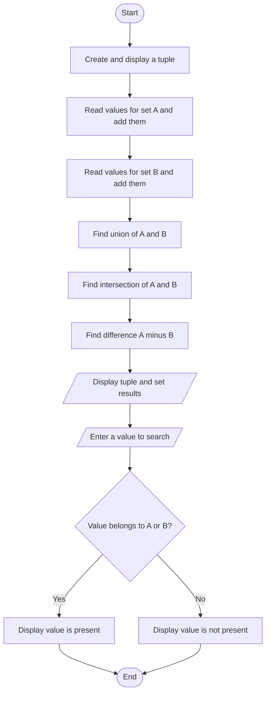

# Tuple and Set Operations — Flowchart

```mermaid
flowchart TD
    A([Start]) --> B[Create and display a tuple]
    B --> C[Read values for set A and add them]
    C --> D[Read values for set B and add them]
    D --> E[Find union of A and B]
    E --> F[Find intersection of A and B]
    F --> G[Find difference A minus B]
    G --> H[/Display tuple and set results/]
    H --> I[/Enter a value to search/]
    I --> J{Value belongs to A or B?}
    J -->|Yes| K[Display value is present]
    J -->|No| L[Display value is not present]
    K --> M([End])
    L --> M
```