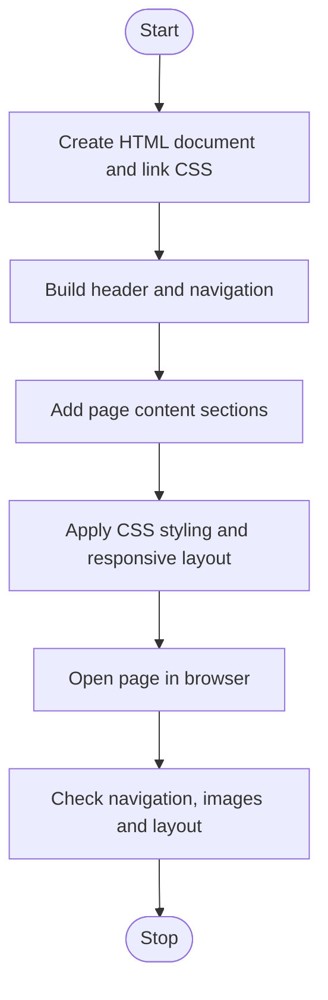

# Student Academic Dashboard – Flowchart

```mermaid
flowchart TD
 A([Start]) --> B[Create HTML document and link CSS]
 B --> C[Build header and navigation]
 C --> D[Add page content sections]
 D --> E[Apply CSS styling and responsive layout]
 E --> F[Open page in browser]
 F --> G[Check navigation, images and layout]
 G --> H([Stop])
```
